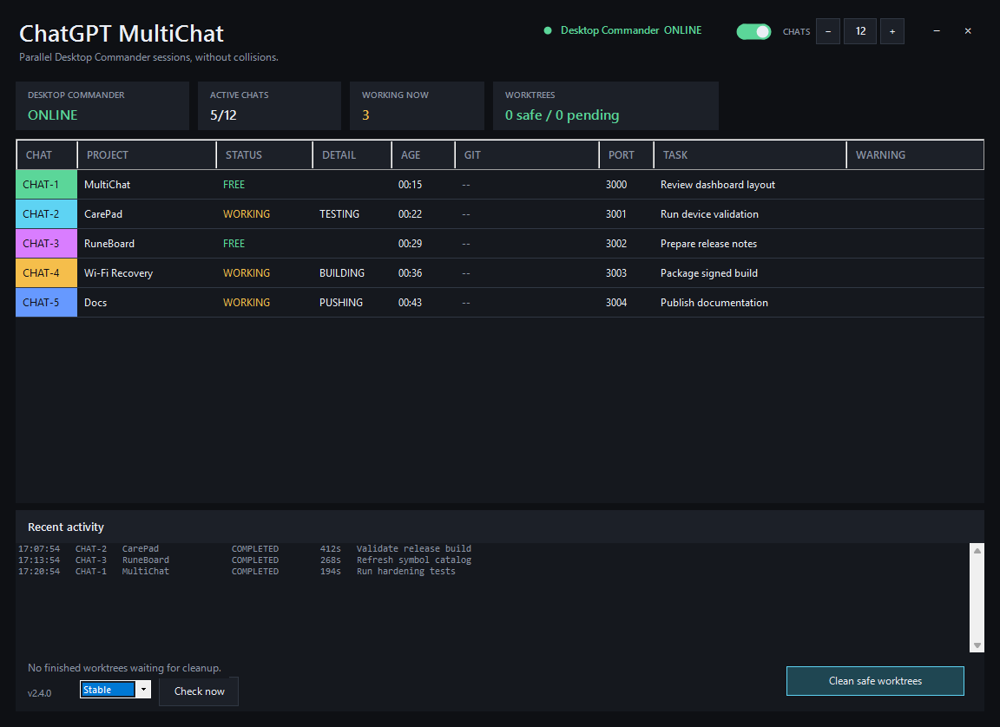
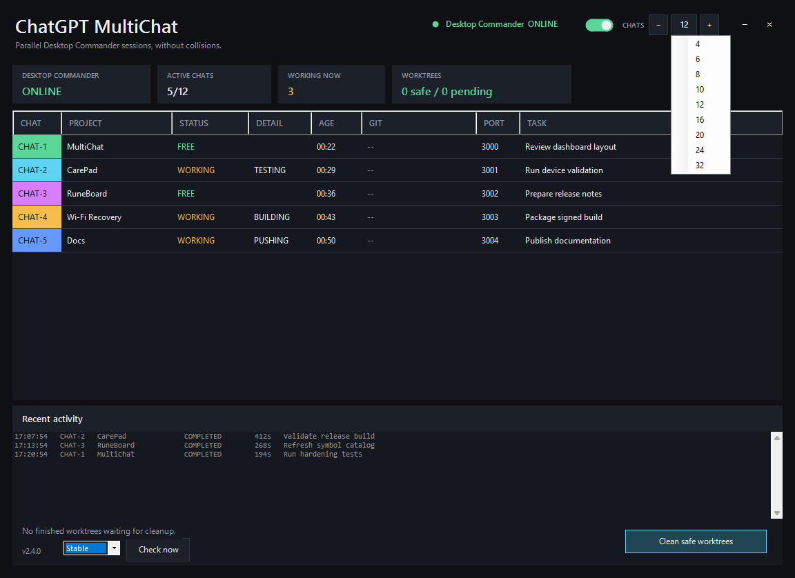
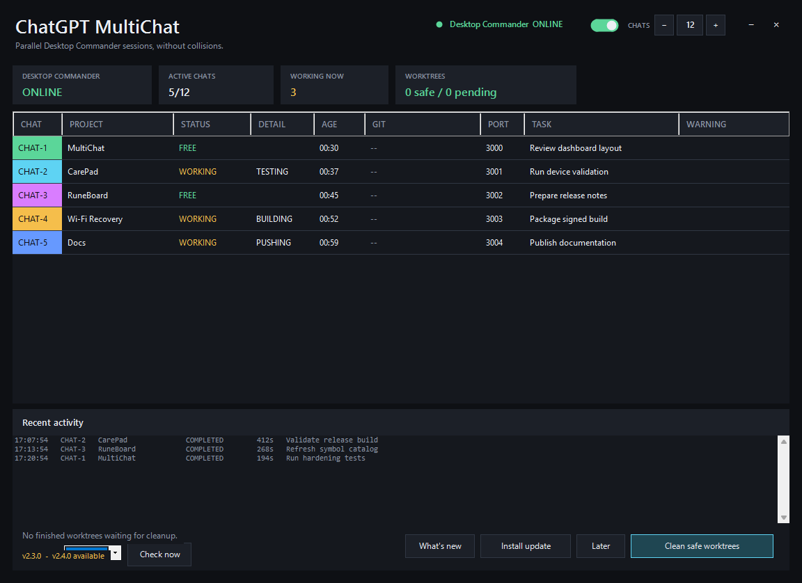

# ChatGPT MultiChat

A portable Windows coordination layer for running **multiple ChatGPT chats through Desktop Commander on the same PC at the same time**.

ChatGPT MultiChat reduces collisions between parallel chats by giving each managed chat its own session, slot, color, optional isolated Git worktree, development port, and shared-resource locks.

> Current version: **v2.4.0**

## Why it exists

When several chats execute local commands independently, they can easily:

- edit the same repository at the same time;
- start development servers on the same port;
- compete for ADB, fastboot, scrcpy, an Android emulator, or another exclusive resource;
- leave behind terminal sessions that are hard to identify;
- overwrite or interfere with another chat's work.

MultiChat turns those independent shells into coordinated sessions.

## How it works

```text
ChatGPT A ─┐
ChatGPT B ─┼─> Start-McpChatSession.ps1
ChatGPT C ─┘          │
                      ├─ assigns CHAT-1 ... CHAT-N (configurable in the dashboard)
                      ├─ tracks status and activity
                      ├─ creates an isolated Git worktree/branch when appropriate
                      ├─ reserves a development port
                      ├─ applies shared-resource locks
                      └─ appears in the MultiChat dashboard
```

Each chat should open **one persistent managed session** and reuse that same process/PID for the entire task. All later commands for that chat should be sent to the same session.

## Main features

- Configurable capacity from **2 to 32 simultaneous managed chats**, editable directly from the dashboard.
- Isolated Git worktrees and branches for repository work.
- Exact-base worktree creation with optional `BaseRef` + full `BaseSha` validation.
- Optional declared `CanonicalRef` for fail-closed integration/cleanup checks.
- Automatic development-port reservation.
- Dynamic resource identities, including Android serials and AVD names.
- Explicit resource wrappers that hold a lock for an entire operation.
- Persistent external-executor leases with heartbeat/TTL and conservative stale handling.
- Activity classification such as `READY`, `BUILD`, `TEST`, `GIT`, `ADB`, `SERVER`, and `WAIT`.
- Redesigned WinForms tray dashboard with a cleaner dark UI, metric cards, and improved table readability.
- Short history of completed sessions.
- Automatic background cleanup of finished worktrees that are verified `SAFE`, with manual cleanup retained as a fallback.
- Recovery of abandoned sessions and dead owner processes.
- Desktop Commander connection status with green/yellow/red LED, plus an On/Off connection switch. Remote access starts **Off** on every MultiChat launch and must be enabled locally when needed.
- Automatic hidden restart of Desktop Commander while the connection switch is On.
- Stable/Beta update channels with manual **Check now**.
- In-app release notes and signed portable self-updates.
- SHA-256 + RSA-4096 verification before an update is installed.
- One-command signed release publishing for the maintainer.
- No automatic Windows startup.
- Portable package with no machine-specific paths or runtime state.

## Screenshots

### Dashboard



<table>
  <tr>
    <td width="50%">
      
    </td>
    <td width="50%">
      
    </td>
  </tr>
  <tr>
    <td align="center"><strong>Live chat-capacity presets</strong></td>
    <td align="center"><strong>Signed update workflow</strong></td>
  </tr>
</table>

The screenshots above were captured from the portable build in an isolated Windows Sandbox environment using demo-only sessions and no personal workspace data.

## What's new in v2.4.0

- Added a dashboard chat-capacity selector: **CHATS [−] N [+]**.
- Capacity can be changed live from **2 to 32 managed chats** without restarting MultiChat.
- Clicking the capacity number opens presets for 4, 6, 8, 10, 12, 16, 20, 24, and 32 chats.
- Reducing capacity is blocked when an active higher-numbered slot would fall outside the new range.
- The active-chat metric updates immediately to the new capacity.
- The core allocator now enforces the same 2–32 range even if `config.json` is edited manually.
- Added 32 distinct dashboard slot colors and expanded console slot coloring.
- Added `CapacityTest.ps1`, including 12-slot, 32-slot, overflow, and manual-config clamp validation.
- UI theme helpers now use an explicitly shared theme so visual components remain reliable when loaded by tests or auxiliary scripts.

## What's new in v2.3.0

- Added a real portable self-updater. **Install update** downloads, verifies, stages, installs, and restarts MultiChat.
- Updates require both a matching SHA-256 checksum and a valid RSA-4096 package signature before any application files are replaced.
- Added **Stable** and **Beta** update channels with correct SemVer prerelease ordering.
- Added **Check now** in the dashboard and tray menu.
- Added an in-app **What's new** dialog using GitHub release notes.
- User configuration is merged into new defaults during updates; runtime state and workspaces are never replaced.
- Failed updates roll application files back and record a result for the next launch.
- Git checkouts are never overwritten by the self-updater; they fall back to the GitHub release page.
- Added `Sign-ReleasePackage.ps1`, `Test-ReleaseSignature.ps1`, and `Publish-Release.ps1`.
- The release public key is shipped with MultiChat; the private signing key remains outside the repository.

## What's new in v2.2.1

- Added a background GitHub Releases update check with a persistent 24-hour cache.
- The installed version is always shown in the dashboard footer.
- When a newer release exists, MultiChat shows the latest version plus **Download update** and **Later** controls.
- Update checks never block the UI and fail silently when the network or GitHub is unavailable.
- The update notification can be disabled with `checkForUpdates` or rescheduled with `updateCheckHours`.
- Update comparison is recalculated against the currently installed version even when release metadata comes from cache.
- MultiChat only opens the release page; it does not self-update or replace files automatically.

## What's new in v2.2.0

- Added exact Git base contracts: `-BaseRef` and full 40-character `-BaseSha` must resolve to the same commit or session creation fails closed.
- Worktrees are created from the validated SHA instead of implicit local `HEAD`.
- Added optional `-CanonicalRef` and cleanup rules that prove either zero own commits relative to `baseSha` or integration into the declared canonical ref.
- Added persistent leases for external executors. `ACTIVE`, `STALE`, `MISMATCH`, and `UNKNOWN` leases protect sessions from expiry, reservation release, and cleanup.
- Added `Invoke-ManagedExternal.ps1` with automatic lease heartbeat and resource retention for long-running external processes.
- Added dynamic Android resource identities such as `android:serial:<serial>` and `android:avd:<name>`; different devices can run concurrently while the same identity collides.
- Added explicit `Invoke-WithChatResource(s)` wrappers for operations that must hold a resource independently of command-regex detection.
- Added `Validate-ManagedSession.ps1` for fail-closed post-execution validation of workspace, base, worktree identity, and lease state.
- Cleanup now verifies exact worktree identity and refuses legacy/ambiguous states such as `BASE_UNKNOWN`, `FOREIGN_WORKTREE_STATE`, or protective leases.
- Replaced the Desktop Commander switch's native CheckBox rendering with a fully custom-drawn panel so hover no longer paints a gray Windows background.
- Added `HardeningTest.ps1` covering resource concurrency, exact-base mismatch, lease expiry/cleanup veto, stale/unknown lease behavior, canonical integration, and SAFE cleanup.

## What's new in v2.1.2

- Fixed the minimize-button container so its hover square is always fully visible.
- Replaced the header's flow layout with fixed-position window controls.
- Added a status LED for Desktop Commander: green `ONLINE`, yellow `CONNECTING`, red `OFFLINE`.
- Added a connection switch in the header. It originally defaulted to On; current hardened builds start remote access Off on every app launch.
- Switching Off stops Desktop Commander and disables automatic reconnect attempts until the switch is turned On again.
- Switching On starts Desktop Commander when needed and transitions through `CONNECTING` to `ONLINE`.

## What's new in v2.1.1

- Fixed the minimize button hover state and centered its glyph.
- Replaced unreliable form-level resizing with eight dedicated resize grips for edges and corners.
- Clarified Git tooltips: for example, `23 new` now explains that those files are not tracked by Git.
- Finished `SAFE` worktrees are cleaned automatically in the background instead of continuously accumulating.
- Auto-clean skips worktrees whose owner process is still alive and keeps manual cleanup as a fallback.
- Stale folders that no longer resolve to their own Git worktree are classified as `NOT_A_WORKTREE` and retained instead of being deleted without verifiable Git state.

## What's new in v2.1.0

- Refreshed dashboard using Segoe UI, flatter controls, status cards, and clearer visual hierarchy.
- Borderless dark window chrome replaces the native white Windows title bar; the custom header remains draggable.
- Git state is now shown with readable labels such as `Clean`, `28 new`, `4 changed`, `ahead 2`, and `behind 1`.
- Worktree scanning and cleanup run in hidden worker processes instead of blocking the UI thread.
- Cleanup uses cached candidates, clears stale counts immediately, revalidates candidates before deletion, and reports failed removals.
- Git summaries, session expiry, liveness validation, and Desktop Commander health checks run in a hidden maintenance worker instead of the UI thread.
- Grid cells are updated only when their displayed value changes.
- Expensive Git checks are avoided during ordinary one-second status refreshes.
- The dashboard reads active sessions through indexed slot files instead of scanning the full session history on every refresh.
- Session/project registry handling is more defensive against malformed stale entries.
- UI helpers are isolated in `MultiChat.UI.ps1`, while performance-sensitive runtime logic is consolidated in `ChatMulti.Advanced.ps1`.

## Requirements

- Windows 10 or Windows 11.
- Windows PowerShell 5.1 or later.
- Git.
- Node.js with `npx`.
- Desktop Commander available through `npx`.

## Quick install

1. Download the portable ZIP from the latest GitHub release.
2. Extract it to a permanent folder.
3. Run `Setup.cmd`.
4. A **ChatGPT MultiChat Agent** shortcut is created on the desktop.
5. Open the agent before starting parallel Desktop Commander work.

`Setup.cmd` does **not** configure automatic startup.

## Using it with ChatGPT

The easiest approach is to give ChatGPT the contents of `PROMPT-FOR-CHATGPT.txt`.

The essential instruction is:

```text
Use the ChatGPT MultiChat system installed on this PC for any Desktop Commander work.
Start one persistent session with Start-McpChatSession.ps1, reuse its PID for the entire task,
and do not modify the project through loose MCP shells. If you work in a Git repository,
use the isolated worktree assigned by MultiChat. Respect resource locks and the assigned port.
```

A chat should start a session similar to:

```powershell
powershell.exe -NoLogo -NoProfile -ExecutionPolicy Bypass `
  -File "C:\path\to\ChatGPT-MultiChat\Start-McpChatSession.ps1" `
  -ProjectPath "C:\path\to\project" `
  -Task "short-task-description"
```

From that point onward, all commands for that task should be sent to the **same PID**.

### Exact-base sessions

When an orchestrator already knows the exact base it expects, pass both the ref and the full SHA:

```powershell
Start-McpChatSession.ps1 `
  -ProjectPath "C:\path\to\project" `
  -Task "validated-task" `
  -BaseRef "origin/main" `
  -BaseSha "0123456789abcdef0123456789abcdef01234567" `
  -CanonicalRef "origin/main"
```

MultiChat does not silently move the requested base. `BaseRef` and `BaseSha` must resolve to the same commit or session creation fails. The caller is responsible for fetching/revalidating the desired ref before starting the session when freshness matters.

`CanonicalRef` is optional. When supplied, it is used later to prove whether commits created in the managed worktree have been integrated. MultiChat never auto-merges them.

For work that should not create a Git worktree:

```powershell
Start-McpChatSession.ps1 `
  -ProjectPath "C:\path\to\project" `
  -Task "test" `
  -NoWorktree
```

Type `exit` or `quit` inside the managed session to release it cleanly.

## Dashboard

The dashboard shows one row per active managed chat:

| Field | Meaning |
|---|---|
| Chat | Assigned slot (`CHAT-1` ... `CHAT-N`, according to the configured capacity) |
| Project | Associated project |
| Activity | `FREE`, `WORKING`, or `ABANDONED` |
| Detail | Detected command/activity type |
| Time | Time since the last state update |
| Git | Compact Git summary |
| Port | Development port reserved for the session |
| Task | Task description supplied when the session started |
| Warning | Conflicts or conditions that need attention |

The header includes a live **CHATS** capacity control. Use **− / +** for one-step changes or click the number for common presets. New sessions immediately use the new limit. MultiChat refuses reductions that would exclude an active higher-numbered slot.

Closing the dashboard window does **not** stop the agent. It remains in the Windows system tray. Use **Exit** from the tray menu to stop it completely.

### Dashboard performance

The visible chat state still refreshes quickly, but expensive work is decoupled from that timer:

- the one-second UI refresh reads only the active slot index and cached values;
- Git summaries, session expiry, PID validation, and Desktop Commander process detection run in a hidden maintenance worker;
- recent history is refreshed separately;
- worktree scanning runs in its own hidden worker;
- worktree cleanup also runs in a hidden worker;
- refresh pauses while the window is moved or resized.

This keeps the WinForms UI responsive even when Git operations take around a second on a larger set of worktrees.

## Session states and expiry

When a managed session is in `READY`, the dashboard displays it as `FREE`. If it remains idle for the configured amount of time, it becomes `ABANDONED`.

Default behavior:

- `ABANDONED`: after 3 minutes in `READY`.
- Clean idle session: may be released after 10 minutes.
- Idle session with local changes: waits 20 minutes.
- Active work such as `BUILD`, `TEST`, `ADB`, or `SERVER`: does not expire while that activity is active.

If the process that owns a session disappears, MultiChat can release its slot, port, and resource locks **only when no protective external lease exists**. An `ACTIVE`, `STALE`, `MISMATCH`, or `UNKNOWN` lease keeps the session fail-closed.

## Git worktrees

Cleanup is deliberately fail-closed.

A finished managed worktree is `SAFE` only when MultiChat can prove all of the following:

- there is no protective lease;
- the workspace is still the exact worktree registered by the originating repository;
- the expected managed branch still matches that worktree;
- the tree has no tracked modifications or untracked files;
- a valid persisted `baseSha` exists and is an ancestor of the worktree HEAD;
- either the worktree has **zero own commits** relative to `baseSha`, or its HEAD is demonstrably integrated into the declared `canonicalRef`.

If any proof is missing, the result is `KEEP`, not deletion. Examples include `BASE_UNKNOWN`, `BASE_INCORRECT`, `CANONICAL_REF_MISSING`, `UNMERGED_COMMITS`, `WORKSPACE_MISMATCH`, `FOREIGN_WORKTREE_STATE`, and protective lease states.

Legacy session records that predate persisted `baseSha` are therefore not auto-cleaned merely because they look clean.

You can still use:

- **Clean safe worktrees** in the dashboard as a manual fallback;
- `Cleanup-Worktrees.ps1` to inspect candidates and reasons;
- `Cleanup-Worktrees.ps1 -Apply` to apply only candidates that remain `SAFE` after immediate revalidation.

The dashboard rescans periodically in the background and reports only the candidates that remain after automatic cleanup.

## Shared-resource locks

Resources are identified by **real identity** whenever possible instead of one global Android lock.

Examples:

- `android:serial:THOR_SERIAL`
- `android:serial:emulator-5554`
- `android:avd:pixel_test`
- `android-sdk`

ADB/fastboot/scrcpy commands with an explicit `-s <serial>` are locked by serial. Emulator launches with `-avd <name>` are locked by AVD name. Two different serials or AVDs can therefore run concurrently, while two operations targeting the same identity collide.

When an ADB-style command omits the serial, MultiChat uses `ANDROID_SERIAL` when present, otherwise it resolves a single connected ADB device when that is unambiguous. If it cannot prove one device identity, it falls back to the conservative `android:adb-default` resource. Ambiguous ADB/fastboot resources conflict with every `android:serial:*` lock, so uncertainty reduces concurrency rather than risking two operations on the same device.

Regex rules in `config.json` remain available for additional static shared resources, but Android serial/AVD isolation is resolved dynamically.

For operations where the lock must remain held for the **entire wrapper operation**, use:

```powershell
Invoke-WithChatResource -Resource "android:serial:emulator-5554" -ScriptBlock {
    # complete operation here
}
```

or `Invoke-WithChatResources` for multiple identities. These wrappers are independent of command-line regex detection.

## External executor leases

Long-running external executors can outlive the interactive shell that launched them. A lease keeps the managed session, worktree, slot, development port, and lease-owned resource locks protected while that executor is active.

Core commands:

- `New-ChatLease`
- `Update-ChatLease` for heartbeat/renewal
- `Close-ChatLease`
- `Invoke-WithChatLease`

For a complete external process wrapper with automatic heartbeat:

```powershell
.\Invoke-ManagedExternal.ps1 `
  -SessionId $env:CHATGPT_SESSION_ID `
  -Owner "external-validator" `
  -Resource "android:serial:emulator-5554" `
  -FilePath "powershell.exe" `
  -ArgumentList @("-NoProfile","-File","run-validation.ps1")
```

Lease states are conservative:

- `ACTIVE`: execution is protected;
- `STALE`: heartbeat expired, but MultiChat still protects the session;
- `MISMATCH`: lease snapshot does not match session/workspace/base;
- `UNKNOWN`: lease evidence exists but cannot be safely interpreted;
- `NONE`: no protective lease is present.

Only `NONE` permits ordinary expiry/release/cleanup. Stale, mismatched, or unreadable lease evidence is never treated as permission to delete work.

`Validate-ManagedSession.ps1` can be used after an external execution to fail closed on workspace/base/lease mismatches:

```powershell
.\Validate-ManagedSession.ps1 `
  -SessionId $env:CHATGPT_SESSION_ID `
  -ExpectedWorkspace $env:CHATGPT_WORKSPACE `
  -ExpectedBaseSha $env:CHATGPT_BASE_SHA `
  -RequireLease
```

## Development ports

Each managed session can reserve a different development port.

The default range starts at port `3000` and contains 100 configurable positions. This prevents two managed chats from accidentally starting development servers on the same port.

## Configuration

The main settings live in `config.json`:

| Setting | Default | Purpose |
|---|---:|---|
| `maxSlots` | 8 | Maximum simultaneous managed chats; dashboard selector supports 2–32 |
| `checkForUpdates` | true | Check GitHub Releases for newer MultiChat versions |
| `updateCheckHours` | 24 | Minimum interval between successful release checks |
| `updateChannel` | stable | Release channel: `stable` or `beta` |
| `refreshSeconds` | 1 | Lightweight chat-status/UI refresh interval |
| `maintenanceRefreshSeconds` | 15 | Background Git, expiry, liveness, and Desktop Commander maintenance interval |
| `historyRefreshSeconds` | 5 | Recent-history refresh interval |
| `cleanupScanSeconds` | 30 | Background worktree-scan interval |
| `autoCleanSafeWorktrees` | true | Automatically remove finished worktrees that pass all SAFE checks |
| `defaultLeaseTtlMinutes` | 60 | Default external-executor lease TTL when a caller does not supply one |
| `abandonedAfterMinutes` | 3 | Time before a READY session is marked abandoned |
| `cleanExpireMinutes` | 10 | Expiry for clean idle sessions |
| `dirtyExpireMinutes` | 20 | Expiry for idle sessions with local changes |
| `portRangeStart` | 3000 | First reservable development port |
| `portRangeCount` | 100 | Number of ports in the reservation pool |
| `historyLimit` | 50 | Maximum stored history entries |
| `remoteDisconnectOnLock` | true | Stop Remote Desktop Commander when Windows is locked |
| `remoteIdleDisconnectMinutes` | 30 | Stop Remote Desktop Commander after this many minutes with no managed chats; `0` disables the idle cutoff |
| `remotePurgeHistoryOnDisconnect` | true | Remove local Desktop Commander tool-history files whenever remote access is stopped |

The three remote-security values above are secure code defaults even when the properties are absent from an older `config.json`. Remote Desktop Commander itself also starts **Off** on every MultiChat launch; this startup rule is not controlled by `config.json`.

MultiChat also synchronizes Desktop Commander's `allowedDirectories` with registered project roots plus the conventional `source\repos` development root. This blocks direct filesystem-tool access outside those locations. It is a guardrail, not an OS sandbox: terminal commands still run with the Windows user's permissions.

Additional static resource-lock rules are defined in `config.json`. Android serial and AVD identities are resolved dynamically by MultiChat.

## Updates and release signing

The dashboard supports two release channels:

- **Stable** uses the latest non-prerelease GitHub Release.
- **Beta** considers both stable releases and prereleases and compares them using SemVer precedence.

**Check now** bypasses the local release cache. **What's new** shows the release notes inside MultiChat. **Later** dismisses the current notification until the app restarts or a different release is discovered.

For ordinary portable installations, **Install update** runs a signed in-place update. MultiChat downloads three matching assets:

- `ChatGPT-MultiChat-VERSION-portable.zip`
- `ChatGPT-MultiChat-VERSION-portable.zip.sha256`
- `ChatGPT-MultiChat-VERSION-portable.zip.sig`

The ZIP must match its SHA-256 file and verify against the bundled RSA-4096 public key before staging begins. Runtime directories such as `state/`, `workspaces/`, and `dist/` are not replaced. Existing user configuration is merged over the new default configuration.

Git checkouts are intentionally excluded from in-place updates to avoid dirtying or overwriting a developer repository.

Release public-key SHA-256 fingerprint:

`1b602bccff512c84efbc67fda6a4bdbcafb61d484102dc5ff973f59107f3e3dd`

The private signing key is stored outside the repository on the maintainer machine. To publish a signed release after updating `VERSION`:

```powershell
.\Publish-Release.ps1
```

This runs the self-test, builds the portable ZIP, creates the SHA-256 file, signs the ZIP, verifies the signature locally, and creates the GitHub Release. Versions containing a prerelease suffix such as `2.4.0-beta.1` are published with GitHub's prerelease flag.

## Main files

| File | Purpose |
|---|---|
| `ChatMulti.psm1` | Session-management core and module loader |
| `ChatMulti.Advanced.ps1` | Configuration cache, ports, history, project resolution, Git/status, cleanup, idle-state, conflicts, and reservations |
| `ChatMulti.Hardening.ps1` | Exact-base validation, dynamic resource identities, leases, worktree identity, canonical integration checks, and fail-closed validation |
| `SecurityTest.ps1` | Static and runtime checks for Remote Desktop Commander hardening, ACLs, authorization storage, and secure defaults |
| `SecretScan.ps1` | High-confidence credential scan for tracked files, with optional Git-history scanning |
| `Harden-DesktopCommander.ps1` | Restricts local Desktop Commander state ACLs and disables telemetry |
| `Emergency-Stop-DesktopCommander.ps1` | Immediately stops remote access, revokes the current server-side device/session when possible, removes local authorization, and supports non-destructive `-DryRun` validation |
| `SECURITY-AUDIT.md` | Threat model, adversarial capability results, implemented mitigations, and residual-risk analysis |
| `MultiChat-Tray.ps1` | Lightweight dashboard orchestration and system-tray agent |
| `MultiChat.UI.ps1` | Reusable WinForms styling and UI helpers |
| `MultiChat-Maintenance.ps1` | Background Git, expiry, liveness, and Desktop Commander maintenance worker |
| `Check-Updates.ps1` | Background GitHub Releases checker with Stable/Beta SemVer comparison and cached release notes |
| `Update-MultiChat.ps1` | Signed portable self-updater with staging, rollback, and config preservation |
| `Sign-ReleasePackage.ps1` | Maintainer-side RSA package signer |
| `Test-ReleaseSignature.ps1` | Public RSA signature verifier |
| `Publish-Release.ps1` | One-command test/build/checksum/sign/verify/GitHub release publisher |
| `RELEASE-PUBLIC-KEY.xml` | Public RSA-4096 key used by the updater to verify release packages |
| `Start-McpChatSession.ps1` | Starts and owns one persistent managed chat session |
| `Setup.cmd` / `Setup.ps1` | Local setup and desktop shortcut |
| `config.json` | Portable configuration |
| `PROMPT-FOR-CHATGPT.txt` | Ready-to-paste ChatGPT instruction |
| `SelfTest.cmd` / `SelfTest.ps1` | System validation |
| `Cleanup-Worktrees.ps1` | Fail-closed worktree cleanup and diagnostic result output |
| `Validate-ManagedSession.ps1` | Post-execution workspace/base/lease validator |
| `Invoke-ManagedExternal.ps1` | Long-running external-process wrapper with lease heartbeat and resource retention |
| `HardeningTest.ps1` | Concurrency, exact-base, lease, and cleanup safety test suite |
| `CapacityTest.ps1` | Isolated dynamic-capacity validation for 12/32 slots and overflow clamps |
| `Show-History.ps1` | Session-history viewer |
| `Make-Portable-Package.ps1` | Builds the portable release ZIP |

## Self-test

Run:

```cmd
SelfTest.cmd
```

Expected result:

```text
SELF-TEST: OK
Dependencies, scripts, configuration, registry robustness, slots, colors and ports: OK.
```

The self-test checks dependencies, PowerShell syntax, configuration, slot behavior, UI controls, port reservation, deterministic update-version detection, and then runs `HardeningTest.ps1`. The hardening suite verifies dynamic-resource concurrency, exact-base creation and mismatch rejection, lease protection, stale/unknown fail-closed behavior, canonical integration, and SAFE cleanup.

## Portability

The project uses paths relative to its own folder.

`Make-Portable-Package.ps1` creates a ZIP without copying machine-local runtime state, logs, sessions, leases, or worktrees. The package recreates empty runtime directories, including `state\leases`, on the target machine.

To build a package:

```powershell
.\Make-Portable-Package.ps1 -Version "2.4.0"
```

## Limitations

MultiChat coordinates processes that **use the MultiChat session system**. It cannot prevent an unrelated terminal, another application, or a chat that ignores the manager from directly editing the same repository or using the same external resource.

The key rule is therefore:

**one chat → one persistent managed session → one reused PID for the entire task.**

## Uninstall

1. Exit the agent from the system-tray icon.
2. Delete the desktop shortcut.
3. Delete the ChatGPT MultiChat folder.

No Windows service or automatic-start entry is installed.
